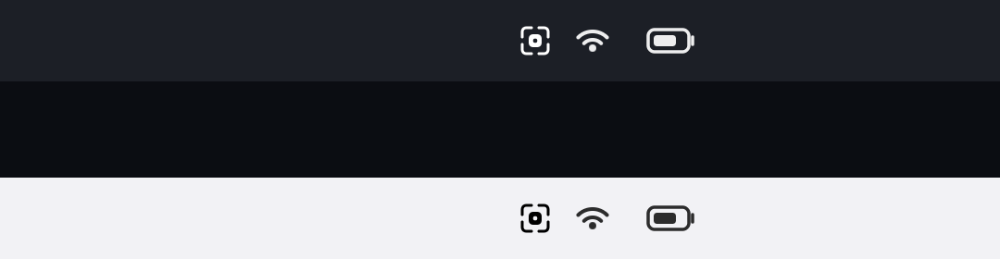

<p align="center">
  <picture>
    <source media="(prefers-color-scheme: dark)" srcset="assets/github/github-banner-dark.png">
    
  </picture>
</p>

<p align="center">
  <a href="LICENSE"></a>
  
  
  
  <a href="https://github.com/nirapod-labs/simenclave/releases"></a>
</p>

# SimEnclave

SimEnclave gives the iOS Simulator a real Secure Enclave. It injects a small interposer into a simulated app, catches the `SecKey` calls, and routes the Secure Enclave ones to your Mac's actual SEP over a local channel. The app signs with real hardware P-256. No mock, no software key, and the app itself imports nothing.

It exists because the iOS Simulator has no Secure Enclave. That means the one thing hardware-backed signing depends on, a key that never leaves the chip, can't run where you develop all day. So every change to a signing path forces you onto a physical device. SimEnclave fixes that without weakening the security property and without ever becoming something that could ship.

> **Status: approaching 1.0.** The mechanism is settled and proven; what's left is release hardening. Targeting v1.0 by end of July 2026.

## How it works

Your Mac has a real Secure Enclave. A menubar helper owns a P-256 key inside it. When a simulated app calls `SecKeyCreateSignature`, an injected interposer, loaded only through a debug scheme environment variable, sends the digest to the helper over an authenticated loopback socket. The helper signs in the Mac's SEP and the signature comes back. The private key never leaves the chip. The only things that cross the wire are a handle, a public key, a digest, and a signature, which is exactly what an app on a real device already handles.

```
simulated app  ──SecKey──▶  interposer  ──loopback──▶  helper  ──▶  Mac Secure Enclave
                              (hook)      (CBOR+token)            (signs, key stays put)
       signature  ◀───────────────────────────────────────────────────┘
```

The app's code doesn't change. The same `SecKeyCreateSignature` that hits the SEP on a device hits the SEP through SimEnclave in the Simulator, and the signature it returns verifies identically against any P-256 verifier. Every keychain or crypto call that isn't a Secure Enclave operation passes straight through, untouched.

<p align="center">
  
</p>

## It can't ship

This is a development tool, and the fact that it can never reach production is enforced in code, not promised in prose. The interposer loads exactly one way: through `DYLD_INSERT_LIBRARIES`, set in the debug Simulator scheme. A release build bundles no interposer and sets no variable, so there's nothing to load.

That's checked on every PR and push. A static fence (`scripts/fence-check.sh`) asserts that any scheme carrying the variable launches the Debug configuration, that no project artifact references the interposer dylib, and that the variable appears only in a reviewed allowlist. A runtime fence asserts that an uninjected app and an injected-but-unconfigured app both show the same stock failing-Secure-Enclave behavior, which proves the app has no dependency on the tool. And the release workflow scans the built `.app` and fails if the dylib or the variable is anywhere inside it.

Read [SECURITY.md](SECURITY.md) before forming an opinion about the whole thing. It's short, and it changes how the tool should be read.

## See it run

Two console apps live under [`examples/`](examples), and they do the same job from two different stacks:

- [`examples/native`](examples/native) is a SwiftUI app.
- [`examples/react-native`](examples/react-native) is an Expo app with a first-party native module.

Both generate keys, sign, verify, and manage keychain items against the same host Secure Enclave through SimEnclave. That's the point of having two: the bridge hooks the `SecKey` C API, so it doesn't care whether the app on top is Swift or JavaScript. Same hardware, same signatures, different framework.

## Install

```sh
brew tap nirapod-labs/simenclave https://github.com/nirapod-labs/simenclave
brew install simenclave
```

Or without Homebrew:

```sh
curl -fsSL https://raw.githubusercontent.com/nirapod-labs/simenclave/main/scripts/install.sh | sh
```

Both build from source and install the menu bar helper plus the `simenclavectl` CLI. Needs Xcode.

## Using it

Open SimEnclave (it runs in the menu bar), then point a debug Simulator scheme at the interposer: `simenclavectl init --dylib <path>`, or click "Copy scheme environment" in the menu and paste it into the scheme. Your existing `SecKey` code then runs in the Simulator against real hardware. The CLI is built to be driven by a person or an agent, JSON output and honest exit codes throughout: `simenclavectl doctor` checks the wiring, `simenclavectl status` confirms the helper is live.

## Architecture

Three deployables and one shared contract, each in its own directory:

- [`packages/protocol`](packages/protocol) is the wire: one spec (length-prefixed CBOR) and two codecs, Swift for the helper and C for the interposer, that have to stay byte-for-byte compatible.
- [`packages/host-core`](packages/host-core) drives the Mac's Secure Enclave through the `SecKey` C API: generate a P-256 key, sign, fetch the public key. The host side.
- [`packages/interpose`](packages/interpose) is the injected dylib. It inline-hooks `SecKey` in the simulated app, redirects the Secure Enclave operations to the helper, and passes everything else through.
- [`apps/helper`](apps/helper) is the menubar app that owns the SEP key and answers requests over loopback. It arms booted simulators automatically, the way SimCam bridges the camera.
- [`tools/simenclavectl`](tools/simenclavectl) is the CLI, with JSON output and honest exit codes so a person or an agent can drive it.

Why an interposer and not a registered provider? A camera can be a virtual device the OS enumerates. The Secure Enclave can't: it's reached through a reserved token id that no third party is allowed to claim, so the only way in is to intercept the call inside the guest process. Inline hooking is the default because it's independent of the symbol-binding format, and the hook backend sits behind a seam so no single library is load-bearing.

## Repository layout

```
packages/
  protocol/        CBOR wire spec + Swift and C codecs
  host-core/       Swift, drives the Mac Secure Enclave
  interpose/       the injected dylib (C), hooks SecKey
apps/
  helper/          the menubar app, owns the key, serves loopback
tools/
  simenclavectl/   the JSON CLI
examples/
  native/          SwiftUI console
  react-native/    Expo console
scripts/           fence checks, mechanism proofs, build helpers
docs/              development guide and design notes
```

## Developing

`make bootstrap` from a fresh clone, then `make build` and `make test`. The toolchain, the editor wiring, and every `make` target are in [docs/development.md](docs/development.md).

`host-core` is a SwiftPM package whose tests need XCTest, so run those through the Xcode toolchain:

```sh
cd packages/host-core
DEVELOPER_DIR=/Applications/Xcode.app/Contents/Developer xcrun swift test
```

## Contributing

PR-driven. Branch off `main`, keep the change focused, open a pull request, and a maintainer reviews and merges. `main` is protected and rejects direct pushes. Conventional commits are enforced by commitlint, and the formatting and commit-message hooks run on commit. Details, and the rule that design comes before code, are in [CONTRIBUTING.md](CONTRIBUTING.md).

## Security

SimEnclave operates only on your own Mac's Secure Enclave keys, in the Simulator, and never on a real user's keys or funds. The threat model, the channel's authentication, and the fence are in [SECURITY.md](SECURITY.md). Found something security-relevant? Report it through GitHub's private vulnerability reporting; SECURITY.md has the steps.

## Who builds it

SimEnclave is built by [Nirapod Labs](https://github.com/nirapod-labs). It came out of building Nirapod, a non-custodial wallet whose security rests on keys that live in hardware and never leave it. That path, the one you most want to exercise on every change, is the one the Simulator can't run, so testing it meant reaching for a physical device every time. So we built the tool we wanted instead: real hardware-backed signing in the Simulator, behind a fence that keeps it from ever following the code into production. It's useful to anyone whose iOS app touches the Secure Enclave, which is why it's open source.

## License

Apache-2.0. See [LICENSE](LICENSE).
