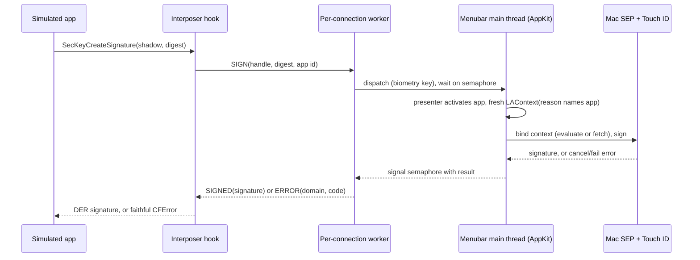

# M3: fidelity and biometry

M2 made the interposer fail-closed: the shadow `SecKeyRef` is a public-key-only
carrier, so a routing miss errors rather than ever emitting a software signature.
That is the spine, and it holds. But a fail-closed shadow is not yet a faithful one.
On the hooked paths it behaves like a device's Secure Enclave key; the moment an app
introspects it, or asks for a biometric prompt, the seams show. M3 closes those
seams. It makes the shadow read as a real SE private key under introspection, it puts
a real Mac Touch ID prompt in the signing loop, it makes a key survive a helper
relaunch, and it makes a routed failure carry the exact error a device returns.

Two properties join the three M2 linchpins. **Faithfulness to introspection**: the
carrier answers `SecKeyCopyAttributes` and `SecKeyCopyExternalRepresentation` the way
a device's SE private key does, without ever holding usable private material. **A
real biometric gate**: a biometry-gated key prompts the developer's own Mac Touch ID
at sign time, and a cancel or a failure surfaces the device's exact `OSStatus`. And
one new safety property arrives with persistence: **keychain confinement**, the rule
that the helper never reads, returns, or deletes a keychain item that is not its own.

This is the helper-and-interposer design for M3. The wire it extends is in
[`packages/protocol/SPEC.md`](../../packages/protocol/SPEC.md); the interposer it
builds on is in [`docs/design/m2-interposer.md`](m2-interposer.md); the helper is in
[`docs/design/m1-helper.md`](m1-helper.md); the dev-only scope and the fence are in
[`SECURITY.md`](../../SECURITY.md). The architecture is settled and unchanged. This
is the design the M3 code follows.

## What M2 left for M3

M2 named its deferrals precisely, and they are M3's charter:

- **The key class is opaque to the interposer.** The helper has supported a
  biometry key class since M1 (the wire carries it in key `9`, and
  `SecureEnclaveService` builds a `[.privateKeyUsage, .biometryCurrentSet]` access
  control when asked). But the interposer never asks. Its `SecKeyCreateRandomKey`
  hook sends a bare `GENERATE`, so every key the bridge makes is silent, because the
  `kSecAttrAccessControl` an app passes is an opaque `SecAccessControlRef` the
  interposer cannot read. Closing this is the gate to everything biometric.
- **Durable persistence is in-session only.** M2's `SecItem` hooks resolve a tag
  against the registry's in-session cache, and the helper's keys are
  `kSecAttrIsPermanent: false`, so nothing survives a relaunch. M3 makes the SEP key
  permanent and the lookup a real keychain query.
- **The fidelity hooks are not installed.** `SecKeyCopyAttributes` and
  `SecKeyCopyExternalRepresentation` fall through to the public carrier, which reports
  key class `public` and happily exports its point. A device's SE private key reports
  `private` and refuses to export. M3 hooks both.
- **The `OSStatus` parity table is a single code.** M2 carries one `OSStatus` (key
  `10`) and reconstructs a `CFError` from it, which is enough for "the helper was
  unreachable." A biometric cancel, a failed match, a lockout: each is a distinct
  code on a device, and M3 has to reproduce each one.
- **The approval prompt has no caller.** M2 introduced the interposer that can name
  the connecting app; M3 is where the menubar surfaces that name and lets the
  developer say no.

None of this reopens the M2 spine. The carrier stays public-key-only and fail-closed;
M3 adds faithfulness on top of it, and the two do not fight, because faithfulness is
about what the carrier *reports* and fail-closed is about what it *cannot do*.

## The opaque access control

Everything biometric starts at one question the interposer cannot answer today: when
the app calls `SecKeyCreateRandomKey`, did it ask for a biometry-gated key?

On a device the app builds the policy with
`SecAccessControlCreateWithFlags(allocator, protection, flags, &error)` and puts the
resulting `SecAccessControlRef` in `kSecAttrAccessControl` inside
`kSecPrivateKeyAttrs`. The flags carry the gate: `.privateKeyUsage` for a signing key,
plus a biometric constraint such as `.biometryCurrentSet`, `.biometryAny`, or
`.userPresence`. The interposer sees the `SecAccessControlRef` in the attributes, but
the ref is **opaque**: there is no public API to read its flags back, and
`SecAccessControlGetConstraints` is SPI this tool will not touch.

So the interposer catches the policy at its source. **M3 hooks
`SecAccessControlCreateWithFlags`** and records the `(protection, flags)` pair keyed by
the `SecAccessControlRef` it returns. There is no other public constructor for the ref
an app passes to a key creation, so hooking the one constructor catches the policy of
every key the bridge will route. At `SecKeyCreateRandomKey` time, the hook reads the
`kSecAttrAccessControl`, looks up its captured `(protection, flags)`, and now knows what
the app asked for.

The side table is keyed on pointer identity like the shadow registry, but its lifecycle
is the opposite and has to be designed as such, not inherited. A shadow is a long-lived
object the registry owns until an explicit `SecItemDelete`, so retain-until-delete fits.
A `SecAccessControlRef` is transient: the app creates it, passes it into one or more key
creations, and drops it, and there is no delete event to hang eviction on. So the table
**retains on capture**, which alone closes the registry's address-reuse hazard and the
capture-to-create TOCTOU in one stroke: while the table holds a reference the object
cannot be freed and its address cannot be recycled, so a later lookup can never read a
stale policy under a reused pointer. It bounds itself with **a small LRU cap**, releasing
the oldest entry when full. It does not consume-on-create, because an app may reuse one
access control across several keys; it leans on the LRU bound, not a delete, to stay
finite. An access control the table never captured, created before the hooks installed,
say, is a lookup miss, and a miss passes through as not-an-SE-policy, toward the existing
silent path.

The hook does two things with the captured policy, and the split matters.

**It interprets minimally, to decide the prompt.** A key needs a foreground prompt at
sign time exactly when its flags carry a biometric or user-presence constraint. That
single bit, biometry versus silent, sets the existing wire key `9`, and it is the
only interpretation the interposer performs.

**It relays the rest faithfully.** The raw `flags` value (key `11`, a `uint`) and the
`protection` constant (key `12`, relayed verbatim as the constant's own string, not
through an interposer-side enum that could drop or remap a value) are forwarded to the
helper, which passes them straight to its own `SecAccessControlCreateWithFlags`. The
interposer does not translate a flag set into its idea of an equivalent one; it relays
the bits the way it relays a signature's bytes. This is a real change to the helper:
`SecureEnclaveService.generate` takes a `Bool` today and hardcodes both the flags and
the protection class, so M3 grows it to accept the relayed flags and protection and
build the access control from them. Let $f$ be the flags the app passed and
$A_{\text{mac}}$ the access control the helper builds; the intent is
$A_{\text{mac}} = \text{flags}^{-1}(f)$, the gate the SEP enforces on the Mac being the
gate the app requested. One step of that is empirical, not proven, and so a **spike**:
that the host's `SecAccessControlCreateWithFlags` accepts the guest's raw flag bits
across the iOS-to-macOS boundary and **rejects** an unsupported bit rather than silently
dropping it. The `SecAccessControlCreateFlags` values are a documented ABI, but a few
constraints may be invalid or mean something different on macOS, so the helper fails
closed on a flag set the host rejects rather than building a weaker gate than was asked.

There is one fidelity boundary this cannot cross, and the design names it rather than
hiding it. A `.biometryCurrentSet` key on a device binds to *that device's* enrolled
biometrics and invalidates when they change. The helper's key binds to the *Mac's*
Touch ID set, so it invalidates when the Mac's fingerprints change, not the simulated
device's. The gating semantics are faithful (a biometric is required, the right
fallback applies, the key invalidates on a biometric-set change); the identity of the
biometric set is the host's. That is inherent to routing to host hardware, it is the
honest cost of a real prompt over a faked one, and a developer testing
enrollment-change invalidation specifically still needs a device.

## Biometry at sign time

A biometry-gated SEP key does not prompt at creation; it prompts when it is *used*.
So the prompt is a property of the `SIGN` path, and the helper has to grow one.

The shape of a faithful prompt is: the developer signs in the simulated app, a Mac
Touch ID sheet appears naming the app that asked, the developer authenticates, and the
signature comes back, or a cancel comes back as the device's cancel error. Getting there
means settling where the prompt runs, then how the signing key binds to it.

**The prompt needs an AppKit host, so it is a menubar-helper capability.** The helper
ships as two deployables built from one kit: `simenclave-menubar`, which creates an
`NSApplication`, takes the `.accessory` policy, and runs `app.run()`; and the CLI
`simenclave-helper`, which has no AppKit and ends in `RunLoop.current.run()`.
`NSApp.activate` and a `LAContext` sheet need the AppKit run loop, so they belong to the
menubar build; calling them from the bare-`RunLoop` CLI is a no-op at best. So M3 does
not pretend "the helper" is one thing. It puts foreground presentation behind a seam:
the menubar build installs a presenter that activates the app and runs the prompt on the
AppKit main thread; the CLI helper installs none and answers a biometry sign with a
clear error, so biometry is a menubar-helper capability and the CLI helper serves silent
keys, which is what headless tests and CI drive. Tests inject a mock presenter that
returns approve, deny, or cancel on demand, so the router's prompt logic runs
deterministically without a real sheet.

**The signing key binds to a fresh, named context.** Each biometric sign builds a new
`LAContext` whose `localizedReason` names the connecting app ("Simulator app *id* is
signing with the Secure Enclave"), the name coming from the interposer (wire key `14`),
because only the guest can name itself over a loopback socket. The binding is a
**spike**, not an assumption, on the M2 CryptoKit lesson, and two mechanisms are on the
table for it to pick between: `LAContext.evaluateAccessControl` to pre-authorize the
in-memory key the helper already holds, which needs no keychain round trip; or a re-fetch
of the permanent key with `kSecUseAuthenticationContext` set to the context. Persistence
lands before this slice, so either is available; the spike also confirms whether the
prompt fires at evaluate, fetch, or sign, whether `localizedReason` carries through, and
whether the accessory app presents the sheet cleanly, against the menubar build that will
actually serve prompts. A silent key skips all of this and signs as it does today.

**Serving has to be concurrent, or one prompt freezes the whole helper.** Here is the
trap, and it is in today's code, not the future. The helper's accept loop is a single
thread running `while running { accept(); serve(client) }`, and `serve` handles its
connection synchronously. If a biometry `serve` parks waiting on a human, the accept
loop is *inside* that call and cannot accept the next connection at all, so a concurrent
silent sign is not merely unprompted, it is stalled at the TCP accept queue behind the
human, on the same one thread. "Silent stays fast" is false until serving is concurrent.
So M3 makes the accept loop hand each accepted connection to its own worker and
immediately loop to accept the next; the handle store is already lock-guarded and the
SEP serializes its own work, so concurrent serves are safe. The invariant to state is
connection-level: *a biometry sign blocks only its own connection, and silent signs on
other connections proceed at M2 latency*. With that, a biometric sign looks like:

The worker blocks on the semaphore while the main thread runs the prompt, but only that
worker; the accept loop has already moved on to the next connection. Two rules keep it
honest. **Prompts serialize** through one presenter, so two biometry signs do not race
two sheets, the second waits its turn. And **a silent sign never reaches the presenter,
the main thread, or the foreground**, so the common path keeps M2's latency and the
bridge does not steal focus for a key that did not ask for a prompt.

## Faithful failures: the OSStatus parity table

When the developer cancels the prompt, or the biometric fails, or the key is locked
out, the app's `do/catch` has to see exactly what it would see on a device. This is
the roadmap's M3 exit phrase, "a cancel surfaces the device error," and it is the part
M3 most has to prove rather than assume.

The trap is that the helper runs on macOS, and the Mac's failure codes are not
guaranteed to be iOS's. If the helper forwarded its own `LAError` or `OSStatus`
verbatim, the simulator would look like a Mac, not like an iPhone, and an app's
device-tuned error handling would diverge. So the helper does not forward its raw
failure. It classifies the failure into a category, user-cancel, authentication-
failed, biometry-lockout, biometry-not-enrolled, biometry-not-available, key-
invalidated, and maps that category to the `(domain, code)` a real iOS device returns
for it.

That mapping is a **device-captured reference table**, not a hand-written guess. A
small capture harness runs on real hardware: it creates a biometry SE key, signs, and
records the exact `CFError` domain and code for each failure path. The table is
committed with its provenance (the OS and device it was captured on), exactly as the
CryptoKit probe is committed, so the claim "this is the device's cancel error" is
backed by a recorded device, not by a code I remembered. Until the capture runs on a
device, the table is seeded from Apple's documented and header values and each entry is
flagged `device-confirm`; those flags must clear before M4 signs off the parity gate,
because M4 is where parity is the release criterion.

The wire grows to carry a faithful error. M2's key `10` already carries an `OSStatus`;
M3 adds key `13`, an error-domain selector, because some authentication failures surface
in a domain other than `kCFErrorDomainOSStatus`, and the interposer has to rebuild the
right domain to be faithful. This is a field added to both ends: the C `se_response`
grows a domain alongside `error_code`, the Swift `Response.failure` grows a domain
alongside its code, and the interposer's `set_error`, which hardcodes
`kCFErrorDomainOSStatus` today, grows a domain argument. So a routed failure carries
`(domain, code)`, and `set_error` builds a `CFError` in that domain with that code, which
is intended to be indistinguishable from the device's, pending the device capture that
clears the `device-confirm` flags. The reconstruction is of the error *envelope*, the
domain and code an app's `do/catch` branches on; it does not reproduce a populated
`userInfo` (`localizedDescription`, an underlying error), which the wire does not carry,
so an app that branches on `localizedDescription` rather than the code still needs a
device. That is a named scope line, not a hidden gap.

$$
\text{err}_{\text{sim}}(\text{category}) \;=\; \text{err}_{\text{device}}(\text{category}),
\qquad \text{category} \in \{\text{cancel}, \text{fail}, \text{lockout}, \dots\}
$$

up to the captured reference. The helper owns the left-to-category map (it knows what
the Mac did); the table owns category-to-device; the interposer rebuilds it on the
guest side.

## Persistence across relaunches

A fixture key has to be there next run. Today it is not: the helper's keys are
`kSecAttrIsPermanent: false` and live in an in-memory dictionary, so a relaunch starts
empty. M3 makes the SEP key durable and the lookup real.

**The key is permanent, in a confined keychain scope.** A key the app creates with a tag
is created `kSecAttrIsPermanent: true` with a `kSecAttrApplicationTag`, in the macOS
data-protection keychain (`kSecUseDataProtectionKeychain: true`, so the keychain returns
key refs and gives the iOS-like semantics the bridge emulates; M2 named this constraint,
M3 takes it on). The SEP key material stays in the SEP across a relaunch; the keychain
holds the reference. An ephemeral create (no tag) keeps M1's in-memory behavior. Using
the data-protection keychain with a stable scope across relaunches is why M1 deferred the
`com.apple.application-identifier` entitlement to here: it gives the helper a keychain
access group, which is the confinement boundary below. Whether an ad-hoc-signed accessory
helper can take that entitlement and a stable access group on the dev's Mac, or whether
M3 falls back to a dedicated keychain the helper owns outright, is a **spike**; the
Developer-ID-signed distribution build is still M5, this is only the local-dev signing
that persistence needs.

**The lookup is a real query.** M3 adds a `FIND_BY_TAG` op (op `6`, appended after
`DELETE`): the interposer sends an app tag, the helper queries its keychain namespace
for the matching key and returns a handle and the public key, or a not-found error.
M2's `SecItemCopyMatching` hook, which resolved a tag against the in-session registry,
now routes `FIND_BY_TAG` to the helper on a registry miss, so the registry becomes a
session cache in front of a durable helper store. On startup the helper enumerates its
namespace and is ready to answer a find for a key made in a previous run. Handles stay
session-scoped and may be reissued across runs; the durable identity is the tag, and
the interposer's registry is rebuilt per session anyway because the guest process also
restarts.

**Per-UDID namespacing is collision-avoidance, not a boundary.** The M1 auth review
settled that a guest-reported simulator UDID is attacker-chosen over loopback and so
cannot be a security boundary. M3 keeps that ruling exactly: the UDID rides the wire (key
`15`) only so two cooperating simulators, or two apps, with the same logical tag do not
collide, and so erasing a simulator can purge its keys. The access boundary remains the
capability token. The namespaced tag is a structured value, a fixed SimEnclave prefix,
then the UDID, then the app's logical tag, but that structure is convenience and hygiene;
it is emphatically *not* what enforces the confinement below, because a token holder could
forge any UDID. Confinement is anchored on a host-controlled scope, never on the
guest-reported tag.

**Keychain confinement is a safety invariant, anchored on the access group.** Persistence
is the first time the helper writes durable state near the developer's own macOS keychain,
so it is the first time the helper could touch a key that is not its own. It must not. The
enforceable boundary is the keychain **access group**, not a tag name:
`kSecAttrApplicationTag` is an exact-match attribute with no prefix operator, so a startup
enumeration cannot say "every tag beginning with the SimEnclave prefix" and would have to
fall back to a class-only `kSecMatchLimitAll` query that matches the developer's keys and
filters in code, which is exactly the query that must never be issued. The access group
has no such gap: every query the helper issues, the startup enumeration and any bulk
`SecItemDelete` included, carries `kSecAttrAccessGroup` set to the helper's group, and the
keychain itself confines the result to items created in that group. Let $K_{\text{dev}}$
be the developer's own keychain items and $Q$ the set the helper's queries can match. Then

$$
Q \cap K_{\text{dev}} = \varnothing
$$

because every query carries the SimEnclave access group, a host-controlled scope the guest
cannot name, so no helper operation, and in particular no `SecItemDelete`, can enumerate,
return, or remove an item outside the tool's group. The SimEnclave tag prefix and the
per-UDID structure are secondary hygiene *inside* that group, never the boundary. (The
data-protection keychain helps but is not sufficient alone: the developer may have their
own data-protection-keychain keys, and the access group is what excludes those.) This
sits alongside fail-closed and passthrough as a property the tool is built to not violate,
and a slice test asserts it directly by planting a foreign keychain item and proving the
helper's find and delete never see it. A purge (clear one UDID's keys, or all of the
tool's keys) is a `SecItemDelete` scoped by the same access group; the polished
`simenclavectl purge` is M5, the scoped delete it calls is M3.

## The fidelity hooks

A public-key carrier is fail-closed but not faithful under introspection. Two calls
expose the gap, and M3 hooks both. The key idea is a clean split: only a **registered
shadow** (the private carrier) gets the override; a public key the bridge handed back
from `SecKeyCopyPublicKey` is a genuine public `SecKeyRef` that already behaves
correctly and passes straight through. The registry is what tells them apart.

**`SecKeyCopyAttributes`.** On a device an SE private key reports
`kSecAttrTokenID = kSecAttrTokenIDSecureEnclave`,
`kSecAttrKeyClass = kSecAttrKeyClassPrivate`,
`kSecAttrKeyType = kSecAttrKeyTypeECSECPrimeRandom`,
`kSecAttrKeySizeInBits = 256`, and, for a permanent key, its
`kSecAttrIsPermanent` and `kSecAttrApplicationTag`. The public carrier, unhooked,
reports class `public` and no token, which is the tell. So for a registered shadow the
hook synthesizes the SE private-key attribute dictionary; for anything else it passes
through. The values that are knowable are set from what the registry already holds
(class, token, type, size, and the tag when the key is permanent); any attribute whose
exact value or presence is not obvious is taken from the same device-reference capture
the parity table uses, so the dictionary matches a real one rather than a plausible
one.

**`SecKeyCopyExternalRepresentation`.** On a device this returns NULL with an error
for an SE private key, because the private key is not exportable. The carrier is a
*public* key, so unhooked it would *succeed* and hand back the public point, which is
the wrong behavior for something claiming to be a private SE key. So for a registered
shadow the hook returns NULL with the device's not-exportable error (its exact domain
and code come from the capture, flagged `device-confirm` until then). Crucially, the
shadow's *public key*, obtained via `SecKeyCopyPublicKey`, is not a registered shadow,
so it passes through and exports normally, which is exactly how a device behaves: the
private key will not export, the public key will. The split gives both behaviors for
free.

Both hooks obey M2's re-entrancy rule: any CoreFoundation they build uses unhooked
entry points, and neither calls a symbol it hooks. And neither weakens the spine, the
math is the point. M2 fixed the set of signatures the interposer can produce at
$S = S_{\text{host SEP}}$. M3 adds an introspection surface
$I = \{\texttt{CopyAttributes}, \texttt{CopyExternalRepresentation}\}$ and makes a
registered shadow $c$ observationally equal to a device SE key $k$ on it,

$$
\mathrm{obs}_I(c) = \mathrm{obs}_I(k), \qquad \text{while still} \quad \mathrm{sign}(c) \in S_{\text{host SEP}}.
$$

The carrier reads as a private SE key and remains unable to produce a software
signature. Faithful to inspection, fail-closed to use.

## The approval prompt

Moved from M2 because it needs the interposer to name the app, and now paired with the
biometric prompt because they share the foreground machinery. On its first Secure
Enclave operation a simulated app triggers a menubar prompt, "Simulator app *id* wants
to use the Secure Enclave," and the developer allows or denies; the answer is
remembered for the session. The app id is the interposer-reported bundle id (wire key
`14`), present on the requests that can prompt.

It is a convenience, **not an access-control boundary**, and the design says so as
plainly as M2 did. The app id is guest-reported and forgeable; a token holder could
claim any id. The token is the boundary. The prompt exists so the developer sees what
is connecting and can silence noise, and so a biometric sign is preceded by a clear
statement of which app is asking. Because it can block on a human, it runs through the
same serialized foreground actor as the biometric prompt: if a first op needs both an
approval and a biometric prompt, the approval comes first, then Touch ID, never two
sheets at once. A denial returns a populated error, not a silent drop, so the app sees
a failure it can handle. Durable, cross-session approval is a nicety deferred past M3;
in-session memory is enough for the convenience it is.

## The wire delta

M3 extends wire v1 the way M1 and M2 did, by **appending**, never by reshaping. The
existing op codes, key indices, and byte layouts are unchanged, so an M2 helper and an
M3 interposer still understand each other's M2 messages. New keys are added at the end
of the index space and new ops after the last one, and the Swift `Request` and
`Response` enums gain their cases **at the end**, because M2's debugging detour proved
that inserting a case at the front shifts the enum layout and Swift's incremental build
then serves a stale cross-module view. Append-only is now a rule, not a preference.

New op:

- **`FIND_BY_TAG` (op `6`).** Token, an app tag (new key `16`, bytes), and the UDID
  (key `15`). The response is the `GENERATE`-shaped handle and public key, or a
  not-found error. It is the durable lookup behind `SecItemCopyMatching`.

New keys:

- **`11` access-control flags** (uint): the raw `SecAccessControlCreateFlags` bits,
  relayed for a faithful recreation.
- **`12` protection class** (text): the `kSecAttrAccessible*` constant the app passed,
  relayed verbatim as its own string rather than through a lossy interposer-side enum.
- **`13` error domain** (uint): selects the `CFError` domain for a faithful failure,
  pairing with key `10`'s code.
- **`14` app id** (text): the interposer-reported bundle id, for the approval prompt
  and the biometric reason string. Non-security.
- **`15` simulator UDID** (text): namespacing only. Non-security.
- **`16` application tag** (bytes): the app's `kSecAttrApplicationTag`, for a
  permanent create and for `FIND_BY_TAG`.

`GENERATE` carries the access-control keys and, when the create is permanent, the app
tag and UDID, so the helper makes a permanent namespaced key with a faithful access
control. The work is the usual four-part change: `SPEC.md`, `protocol.cddl`, both codecs
(C and Swift) byte-for-byte, and byte-exact codec tests, with the existing M2 vectors
unchanged as a regression. Two existing-code facts make the append safe and are worth
stating rather than rediscovering. Both decoders ignore unknown map keys (the Swift
`CBORMap` reads named keys from a dict; the C reader keeps all entries and `find` skips
the unrecognized), so the new keys disturb neither end, and an old end even tolerates a
new message beyond the decode-old-messages guarantee. And the C decoder decodes only
*responses*, whose largest M3 shape is an error at five keys (op, status, error, code,
domain), well under its `entries[8]` cap, so the cap needs no change; the requests that
grow to eight keys are decoded by the Swift side, which is dict-backed and uncapped. The
C client's receive buffer, named in M2 as a ceiling to watch, is checked against the
largest M3 response (a `FIND_BY_TAG` result is a handle plus a 65-byte public key, no
larger than `GENERATE`), so it needs no raise, but the check is part of the slice.

## Threat model and custody, M3

This sits under [`SECURITY.md`](../../SECURITY.md) and extends M2's section.

**Gate-0 and the custody gate.** SimEnclave custodies no user funds and holds no user
keys. M3's new surfaces (a biometric prompt, durable keychain state, error mapping,
attribute hooks, an approval prompt) move no keys and reconstruct none. The private
key still never leaves the host SEP; persistence keeps it *in* the SEP and stores only
a keychain reference, which is not exportable, a property M3 now enforces by hooking
the export call. So the custody gate passes, as it did in M0 through M2, and M3 in fact
*adds* a protective property rather than spending one. The three M2 linchpins are
unweakened:

1. **Fail-closed** is untouched. The carrier stays public-key-only; the fidelity hooks
   change only what it *reports*, never what it can *do*, and the export hook removes
   the one way the public carrier could have leaked behavior unlike a private key.
2. **Passthrough** gains hooks but keeps its rules: the new
   `SecAccessControlCreateWithFlags`, `SecKeyCopyAttributes`, and
   `SecKeyCopyExternalRepresentation` hooks act only on a positive SE signal (a
   captured policy, a registered shadow) and pass everything else straight through to
   the saved original, byte-identical.
3. **The fence** is unchanged. M3 adds no load path; the constructor stays inert
   without configuration, and the release-build assertion is still the sole gate.

And M3 adds a fourth, **keychain confinement** ($Q \cap K_{\text{dev}} = \varnothing$),
which protects the developer's own keychain from a tool that now writes durable state
near it.

The deltas worth stating as risks, each with its mitigation:

- **Durable state in the developer's keychain.** Mitigated by confinement: every query
  carries the helper's keychain access group, a host-controlled scope the guest cannot
  name, with a direct planted-foreign-item test and an access-group-scoped purge.
- **A foreground, focus-stealing prompt.** Mitigated by serialization (one sheet at a
  time), by naming the app, and by the prompt being non-load-bearing, so even a
  spoofed or spammed prompt is a nuisance, not a breach; the token still gates access.
- **Guest-reported wire fields** (app id, UDID, access-control flags). All non-
  security by construction: the app id and UDID gate nothing, and forged flags only
  change the gating of the forger's *own* key, which is self-harm at most.
- **The host biometric set, not the device's.** A fidelity boundary, documented above,
  not a security issue: the gate is real, its anchor is the host.

The interposer still holds the token in the guest environment, which M1's threat model
covers as same-user and out of scope; M3 logs none of the new fields and none of the
prompt content beyond what the menubar shows the developer.

## What is M3, and what is not

M3 is done when, on a Mac with a real Secure Enclave:

- A biometry-gated create routes as biometry (the access control is captured at its
  source and relayed), and a biometry sign on the menubar build brings up a real Mac
  Touch ID prompt naming the app, while a silent key never prompts and is never stalled
  behind one.
- A canceled or failed prompt surfaces, through the interposer, the `(domain, code)` from
  a committed reference table whose entries stay `device-confirm` until a device run; the
  mechanism (classify, map, rebuild) is what M3 proves, the device numbers clear with the
  capture.
- A key created in one helper run is found and signed in the next, two UDIDs do not
  collide, and a foreign keychain item is provably never matched or deleted.
- A shadow reads as a private SE key under `SecKeyCopyAttributes` and refuses
  `SecKeyCopyExternalRepresentation`, while its public key still exports.
- A new app id raises an approval prompt on the menubar build, and approval persists for
  the session.

with the native C and Swift suites green, the prompt paths exercised headless through a
mock presenter, and the real-sheet and device-number paths verified on the menubar build
and a device respectively, as the existing hardware-only tests skip cleanly without an
SEP.

Deferred, and to where:

- The parity *test* as a release gate, the fence test, the hook unit tests, the
  self-hosted hardware runner, and the security review of the interposer and channel:
  **M4**. The M3 reference table feeds M4's parity test; M3 builds the faithfulness,
  M4 gates on it.
- The `simenclavectl` polish (the `doctor`, `init`, `purge`, `keys` commands that wrap
  M3's mechanisms), and the example apps: **M5**.
- Durable cross-session approval, and peer code-signature or audit-token verification
  on the socket: after 1.0, when the dev threat model tightens.
- Algorithm coverage beyond the `X962` SHA-256 allowlist: when an app needs it,
  unchanged from M2.

## The slices

Each slice is a PR that stays green, in the M1 and M2 rhythm: the wire and the capture
spine first, then durable persistence, then the prompt it enables, then faithful failures
and fidelity, then the convenience. Hardware-only behavior skips without an SEP, so every
slice is green on the portable lane and proven on the Mac.

1. **The wire grows for M3.** `SPEC.md`, `protocol.cddl`, both codecs, and byte-exact
   tests gain op `6` (`FIND_BY_TAG`) and keys `11`-`16`, all appended, with the M2 vectors
   unchanged as a regression and the Swift enum cases added at the end. Key `12` is
   relayed text, and `Response.failure` and `se_response` grow a domain field. No behavior.
   Green when both codecs round-trip the new op and fields byte-identically and every M2
   vector still passes.
2. **Access-control capture and faithful create.** Hook `SecAccessControlCreateWithFlags`
   into a retain-on-capture, LRU-bounded side table (the retain closes the address-reuse
   and capture-to-create TOCTOU hazards, the LRU bounds growth since there is no delete
   event); at create, read the `kSecAttrAccessControl`, set key `9` from a minimal
   interpretation, and relay the raw flags (key `11`) and protection (key `12`); grow
   `SecureEnclaveService.generate` to accept them and build the access control, failing
   closed on a flag set the host rejects. Green when an app's biometry-gated create yields
   a biometry-gated SEP key and a silent create is unchanged, both observed on the helper,
   with the cross-OS flag-validity spike resolved.
3. **Durable persistence and confinement.** Permanent keys in the data-protection keychain
   under the helper's access group (resolve the entitlement-versus-dedicated-keychain spike
   first); startup enumeration scoped by the access group; `FIND_BY_TAG` querying the
   keychain; `SecItemCopyMatching` routing it on a registry miss; the confinement invariant
   ($Q \cap K_{\text{dev}} = \varnothing$, every query carrying the access group) and a
   scoped purge. It lands before the prompt because the prompt's bind path can use a
   permanent key. Green when a key from one run is found and signed in the next, two UDIDs
   do not collide, and a planted foreign item is provably never matched or deleted.
4. **The biometric prompt at sign time.** Make connection serving concurrent (each
   accepted connection on its own worker, so a parked prompt blocks only its connection),
   put foreground presentation behind a seam the menubar build fills and the CLI helper
   does not (biometry is a menubar-helper capability; tests inject a mock presenter), and
   grow the sign path with the main-thread hop, the semaphore, and the serialized
   presenter. Resolve the bind spike (`evaluateAccessControl` pre-auth versus
   context-scoped fetch). Green when a biometry sign raises a real Touch ID prompt on the
   menubar build and a successful auth yields a verifying signature, a silent sign never
   touches the foreground and is not stalled behind a prompt on another connection, and
   the mock-presenter paths are green headless.
5. **Faithful failures.** Land the device-reference capture harness and the committed
   table; the helper classifies its macOS failure and maps it to the device `(domain,
   code)`; the wire carries key `13`; `set_error` grows a domain argument and rebuilds the
   exact `CFError`. Green when a canceled prompt surfaces the cancel error through the
   interposer and the table is committed with provenance, its entries `device-confirm`
   until a device run (which may fall in M4 with the parity gate).
6. **The fidelity hooks.** Hook `SecKeyCopyAttributes` (a registered shadow reports the
   SE token and private class, from the reference) and `SecKeyCopyExternalRepresentation`
   (a registered shadow returns the device's not-exportable error; its public key still
   exports). Green when a shadow reads as a private SE key and refuses export while its
   public key exports, matching the reference.
7. **The approval prompt.** The interposer reports the app id; the helper keys an
   in-session approval set, prompts on a new app's first op through the same serialized
   presenter, remembers the answer, and returns a populated error on denial. Green when a
   new app id raises a prompt and approval persists for the session, with the prompt
   skippable headless via the mock presenter.
