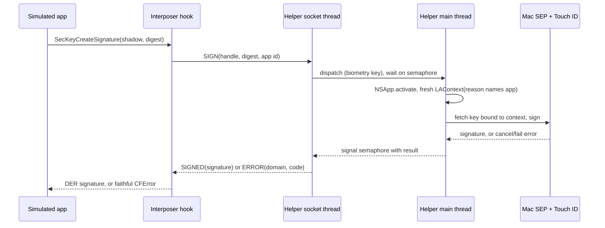

# M3: fidelity and biometry

M2 made the interposer fail-closed: the shadow `SecKeyRef` is a public-key-only
carrier, so a routing miss errors rather than ever emitting a software signature.
That is the spine, and it holds. But a fail-closed shadow is not yet a faithful one.
On the hooked paths it behaves like a device's Secure Enclave key; the moment an app
introspects it, or asks for a biometric prompt, the seams show. M3 closes those
seams. It makes the shadow read as a real SE private key under introspection, it puts
a real Mac Touch ID prompt in the signing loop, it makes a key survive a helper
relaunch, and it makes a routed failure carry the exact error a device returns.

Two properties join the three M2 linchpins. **Faithfulness to introspection**: the
carrier answers `SecKeyCopyAttributes` and `SecKeyCopyExternalRepresentation` the way
a device's SE private key does, without ever holding usable private material. **A
real biometric gate**: a biometry-gated key prompts the developer's own Mac Touch ID
at sign time, and a cancel or a failure surfaces the device's exact `OSStatus`. And
one new safety property arrives with persistence: **keychain confinement**, the rule
that the helper never reads, returns, or deletes a keychain item that is not its own.

This is the helper-and-interposer design for M3. The wire it extends is in
[`packages/protocol/SPEC.md`](../../packages/protocol/SPEC.md); the interposer it
builds on is in [`docs/design/m2-interposer.md`](m2-interposer.md); the helper is in
[`docs/design/m1-helper.md`](m1-helper.md); the dev-only scope and the fence are in
[`SECURITY.md`](../../SECURITY.md). The architecture is settled and unchanged. This
is the design the M3 code follows.

## What M2 left for M3

M2 named its deferrals precisely, and they are M3's charter:

- **The key class is opaque to the interposer.** The helper has supported a
  biometry key class since M1 (the wire carries it in key `9`, and
  `SecureEnclaveService` builds a `[.privateKeyUsage, .biometryCurrentSet]` access
  control when asked). But the interposer never asks. Its `SecKeyCreateRandomKey`
  hook sends a bare `GENERATE`, so every key the bridge makes is silent, because the
  `kSecAttrAccessControl` an app passes is an opaque `SecAccessControlRef` the
  interposer cannot read. Closing this is the gate to everything biometric.
- **Durable persistence is in-session only.** M2's `SecItem` hooks resolve a tag
  against the registry's in-session cache, and the helper's keys are
  `kSecAttrIsPermanent: false`, so nothing survives a relaunch. M3 makes the SEP key
  permanent and the lookup a real keychain query.
- **The fidelity hooks are not installed.** `SecKeyCopyAttributes` and
  `SecKeyCopyExternalRepresentation` fall through to the public carrier, which reports
  key class `public` and happily exports its point. A device's SE private key reports
  `private` and refuses to export. M3 hooks both.
- **The `OSStatus` parity table is a single code.** M2 carries one `OSStatus` (key
  `10`) and reconstructs a `CFError` from it, which is enough for "the helper was
  unreachable." A biometric cancel, a failed match, a lockout: each is a distinct
  code on a device, and M3 has to reproduce each one.
- **The approval prompt has no caller.** M2 introduced the interposer that can name
  the connecting app; M3 is where the menubar surfaces that name and lets the
  developer say no.

None of this reopens the M2 spine. The carrier stays public-key-only and fail-closed;
M3 adds faithfulness on top of it, and the two do not fight, because faithfulness is
about what the carrier *reports* and fail-closed is about what it *cannot do*.

## The opaque access control

Everything biometric starts at one question the interposer cannot answer today: when
the app calls `SecKeyCreateRandomKey`, did it ask for a biometry-gated key?

On a device the app builds the policy with
`SecAccessControlCreateWithFlags(allocator, protection, flags, &error)` and puts the
resulting `SecAccessControlRef` in `kSecAttrAccessControl` inside
`kSecPrivateKeyAttrs`. The flags carry the gate: `.privateKeyUsage` for a signing key,
plus a biometric constraint such as `.biometryCurrentSet`, `.biometryAny`, or
`.userPresence`. The interposer sees the `SecAccessControlRef` in the attributes, but
the ref is **opaque**: there is no public API to read its flags back, and
`SecAccessControlGetConstraints` is SPI this tool will not touch.

So the interposer catches the policy at its source. **M3 hooks
`SecAccessControlCreateWithFlags`** and records the `(protection, flags)` pair keyed
by the `SecAccessControlRef` it returns, in a small side table with the same
pointer-identity model the shadow registry uses. There is no other public constructor
for the ref an app passes to a key creation, so hooking the one constructor catches
the policy of every key the bridge will route. At `SecKeyCreateRandomKey` time, the
hook reads the `kSecAttrAccessControl`, looks up its captured `(protection, flags)`,
and now knows what the app asked for.

The hook does two things with the captured policy, and the split matters.

**It interprets minimally, to decide the prompt.** A key needs a foreground prompt at
sign time exactly when its flags carry a biometric or user-presence constraint. That
single bit, biometry versus silent, sets the existing wire key `9`, and it is the
only interpretation the interposer performs.

**It relays the rest faithfully.** The raw `flags` value and the `protection`
constant are forwarded to the helper verbatim (new wire keys `11` and `12`), and the
helper passes the same bits to its own `SecAccessControlCreateWithFlags`. The
interposer does not translate a flag set into its idea of an equivalent one; it
relays the bits, the way it relays a signature's bytes, because the flags are an ABI
the OS defines and the bridge has no business reinterpreting. Let $f$ be the flags the
app passed and $A_{\text{mac}}$ the access control the helper builds. Then
$A_{\text{mac}} = \text{flags}^{-1}(f)$, so the gate the SEP enforces on the Mac is
the gate the app requested, bit for bit.

There is one fidelity boundary this cannot cross, and the design names it rather than
hiding it. A `.biometryCurrentSet` key on a device binds to *that device's* enrolled
biometrics and invalidates when they change. The helper's key binds to the *Mac's*
Touch ID set, so it invalidates when the Mac's fingerprints change, not the simulated
device's. The gating semantics are faithful (a biometric is required, the right
fallback applies, the key invalidates on a biometric-set change); the identity of the
biometric set is the host's. That is inherent to routing to host hardware, it is the
honest cost of a real prompt over a faked one, and a developer testing
enrollment-change invalidation specifically still needs a device.

## Biometry at sign time

A biometry-gated SEP key does not prompt at creation; it prompts when it is *used*.
So the prompt is a property of the `SIGN` path, and the helper has to grow one.

The shape of a faithful prompt is: the developer signs in the simulated app, a Mac
Touch ID sheet appears naming the app that asked, the developer authenticates, and the
signature comes back, or a cancel comes back as the device's cancel error. Three
mechanisms have to come together for that, and each is a change to the helper.

**Foreground.** The helper is an accessory app with no dock icon. A Touch ID sheet
from a background accessory is at best unattributed and at worst does not present, so
before a biometric prompt the helper brings itself foreground
(`NSApp.activate`) and runs the prompt on the main thread, where
LocalAuthentication's UI belongs.

**A named context.** The helper creates a fresh `LAContext` per biometric sign, sets
its `localizedReason` to name the connecting app ("Simulator app *id* is signing with
the Secure Enclave"), and binds the signing key to that context. The app name comes
from the interposer (the same app id the approval prompt uses, wire key `14`), because
only the guest can name itself over a loopback socket.

**The bind path.** Persistence and biometry compose here, and that is the design
insight that orders the slices. Because an M3 SE key is permanent in the keychain, the
helper binds the prompt by re-fetching the key with the context:
`SecItemCopyMatching` with `kSecUseAuthenticationContext` set to the fresh `LAContext`
returns a `SecKeyRef` bound to it, and the subsequent `SecKeyCreateSignature` prompts
with that context's reason. A silent key skips all of this and signs as it does today.

The exact API path is a **spike**, not an assumption. M2's CryptoKit finding is the
standing lesson: the design states the intended mechanism (foreground, a fresh named
`LAContext`, bind by context-scoped fetch), and a small spike confirms whether the
prompt fires at fetch or at sign, whether `localizedReason` carries through, and
whether an accessory app presents the sheet cleanly, before the slice's behavior is
trusted. What the spike finds is captured the way the CryptoKit probe was.

The threading model is the other half. The router is synchronous on a per-connection
socket thread today, which is correct for the microsecond silent path and wrong for a
prompt that blocks on a human. So a biometric sign:

The socket thread hands a biometry sign to the main thread and blocks on a semaphore,
preserving the one-request-per-connection wire model while the human is in the loop.
Two more rules keep it honest. **Prompts serialize**: at most one foreground
interaction is in flight at a time, through a single prompt actor, so two concurrent
biometry signs do not race two sheets; the second waits. And **a silent sign never
touches the main thread or the foreground**, so the common path keeps M2's latency and
the bridge does not steal focus for a key that did not ask for a prompt.

## Faithful failures: the OSStatus parity table

When the developer cancels the prompt, or the biometric fails, or the key is locked
out, the app's `do/catch` has to see exactly what it would see on a device. This is
the roadmap's M3 exit phrase, "a cancel surfaces the device error," and it is the part
M3 most has to prove rather than assume.

The trap is that the helper runs on macOS, and the Mac's failure codes are not
guaranteed to be iOS's. If the helper forwarded its own `LAError` or `OSStatus`
verbatim, the simulator would look like a Mac, not like an iPhone, and an app's
device-tuned error handling would diverge. So the helper does not forward its raw
failure. It classifies the failure into a category, user-cancel, authentication-
failed, biometry-lockout, biometry-not-enrolled, biometry-not-available, key-
invalidated, and maps that category to the `(domain, code)` a real iOS device returns
for it.

That mapping is a **device-captured reference table**, not a hand-written guess. A
small capture harness runs on real hardware: it creates a biometry SE key, signs, and
records the exact `CFError` domain and code for each failure path. The table is
committed with its provenance (the OS and device it was captured on), exactly as the
CryptoKit probe is committed, so the claim "this is the device's cancel error" is
backed by a recorded device, not by a code I remembered. Until the capture runs on a
device, the table is seeded from Apple's documented and header values and each entry is
flagged `device-confirm`; those flags must clear before M4 signs off the parity gate,
because M4 is where parity is the release criterion.

The wire grows to carry a faithful error. M2's key `10` already carries an `OSStatus`;
M3 adds key `13`, an error-domain selector, because some authentication failures
surface in a domain other than `kCFErrorDomainOSStatus`, and the interposer has to
rebuild the right domain to be faithful. So a routed failure carries `(domain, code)`,
and the interposer's `set_error` builds a `CFError` in that domain with that code,
indistinguishable from the one the device's Security framework would have built.

$$
\text{err}_{\text{sim}}(\text{category}) \;=\; \text{err}_{\text{device}}(\text{category}),
\qquad \text{category} \in \{\text{cancel}, \text{fail}, \text{lockout}, \dots\}
$$

up to the captured reference. The helper owns the left-to-category map (it knows what
the Mac did); the table owns category-to-device; the interposer rebuilds it on the
guest side.

## Persistence across relaunches

A fixture key has to be there next run. Today it is not: the helper's keys are
`kSecAttrIsPermanent: false` and live in an in-memory dictionary, so a relaunch starts
empty. M3 makes the SEP key durable and the lookup real.

**The key is permanent and namespaced.** A key the app creates with a tag is created
`kSecAttrIsPermanent: true` with a `kSecAttrApplicationTag`, in the macOS keychain,
with `kSecUseDataProtectionKeychain: true` so the keychain returns key refs and gives
the iOS-like semantics the bridge is emulating (M2 named this constraint; M3 takes it
on). The SEP key material stays in the SEP across a relaunch; the keychain holds the
reference. An ephemeral create (no tag) keeps M1's in-memory behavior.

**The lookup is a real query.** M3 adds a `FIND_BY_TAG` op (op `6`, appended after
`DELETE`): the interposer sends an app tag, the helper queries its keychain namespace
for the matching key and returns a handle and the public key, or a not-found error.
M2's `SecItemCopyMatching` hook, which resolved a tag against the in-session registry,
now routes `FIND_BY_TAG` to the helper on a registry miss, so the registry becomes a
session cache in front of a durable helper store. On startup the helper enumerates its
namespace and is ready to answer a find for a key made in a previous run. Handles stay
session-scoped and may be reissued across runs; the durable identity is the tag, and
the interposer's registry is rebuilt per session anyway because the guest process also
restarts.

**Per-UDID namespacing is hygiene, not security.** The M1 auth review settled that a
guest-reported simulator UDID is attacker-chosen over loopback and so cannot be a
security boundary. M3 keeps that ruling: the UDID rides the wire (key `15`) only to
namespace keys so two simulators or two apps with the same logical tag do not collide,
and so erasing a simulator can purge its keys. The access boundary remains the
capability token, exactly as in M1. The namespaced keychain tag is a structured value,
a fixed SimEnclave prefix, then the UDID, then the app's logical tag, and that
structure is what makes both isolation and the next property hold.

**Keychain confinement is a safety invariant.** Persistence is the first time the
helper writes durable state into the developer's own macOS keychain, so it is the
first time the helper could touch a key that is not its own. It must not. Every item
the helper creates carries the SimEnclave prefix, and every query the helper issues is
scoped by that prefix. Let $K_{\text{dev}}$ be the developer's own keychain items and
$Q$ the set the helper's queries can match. Then

$$
Q \cap K_{\text{dev}} = \varnothing
$$

by construction: a query that does not carry the SimEnclave prefix is never issued, so
no helper operation, and in particular no `SecItemDelete`, can ever enumerate, return,
or remove an item the developer created outside the tool. This sits alongside fail-
closed and passthrough as a property the tool is built to not violate, and a slice
test asserts it directly by planting a foreign keychain item and proving the helper's
find and delete never see it. A purge path (clear one UDID's keys, or all of the
tool's keys) lives behind the same prefix scope; the polished `simenclavectl` purge is
M5, but the scoped delete it calls is M3.

## The fidelity hooks

A public-key carrier is fail-closed but not faithful under introspection. Two calls
expose the gap, and M3 hooks both. The key idea is a clean split: only a **registered
shadow** (the private carrier) gets the override; a public key the bridge handed back
from `SecKeyCopyPublicKey` is a genuine public `SecKeyRef` that already behaves
correctly and passes straight through. The registry is what tells them apart.

**`SecKeyCopyAttributes`.** On a device an SE private key reports
`kSecAttrTokenID = kSecAttrTokenIDSecureEnclave`,
`kSecAttrKeyClass = kSecAttrKeyClassPrivate`,
`kSecAttrKeyType = kSecAttrKeyTypeECSECPrimeRandom`,
`kSecAttrKeySizeInBits = 256`, and, for a permanent key, its
`kSecAttrIsPermanent` and `kSecAttrApplicationTag`. The public carrier, unhooked,
reports class `public` and no token, which is the tell. So for a registered shadow the
hook synthesizes the SE private-key attribute dictionary; for anything else it passes
through. The values that are knowable are set from what the registry already holds
(class, token, type, size, and the tag when the key is permanent); any attribute whose
exact value or presence is not obvious is taken from the same device-reference capture
the parity table uses, so the dictionary matches a real one rather than a plausible
one.

**`SecKeyCopyExternalRepresentation`.** On a device this returns NULL with an error
for an SE private key, because the private key is not exportable. The carrier is a
*public* key, so unhooked it would *succeed* and hand back the public point, which is
the wrong behavior for something claiming to be a private SE key. So for a registered
shadow the hook returns NULL with the device's not-exportable error (its exact domain
and code come from the capture, flagged `device-confirm` until then). Crucially, the
shadow's *public key*, obtained via `SecKeyCopyPublicKey`, is not a registered shadow,
so it passes through and exports normally, which is exactly how a device behaves: the
private key will not export, the public key will. The split gives both behaviors for
free.

Both hooks obey M2's re-entrancy rule: any CoreFoundation they build uses unhooked
entry points, and neither calls a symbol it hooks. And neither weakens the spine, the
math is the point. M2 fixed the set of signatures the interposer can produce at
$S = S_{\text{host SEP}}$. M3 adds an introspection surface
$I = \{\texttt{CopyAttributes}, \texttt{CopyExternalRepresentation}\}$ and makes a
registered shadow $c$ observationally equal to a device SE key $k$ on it,

$$
\mathrm{obs}_I(c) = \mathrm{obs}_I(k), \qquad \text{while still} \quad \mathrm{sign}(c) \in S_{\text{host SEP}}.
$$

The carrier reads as a private SE key and remains unable to produce a software
signature. Faithful to inspection, fail-closed to use.

## The approval prompt

Moved from M2 because it needs the interposer to name the app, and now paired with the
biometric prompt because they share the foreground machinery. On its first Secure
Enclave operation a simulated app triggers a menubar prompt, "Simulator app *id* wants
to use the Secure Enclave," and the developer allows or denies; the answer is
remembered for the session. The app id is the interposer-reported bundle id (wire key
`14`), present on the requests that can prompt.

It is a convenience, **not an access-control boundary**, and the design says so as
plainly as M2 did. The app id is guest-reported and forgeable; a token holder could
claim any id. The token is the boundary. The prompt exists so the developer sees what
is connecting and can silence noise, and so a biometric sign is preceded by a clear
statement of which app is asking. Because it can block on a human, it runs through the
same serialized foreground actor as the biometric prompt: if a first op needs both an
approval and a biometric prompt, the approval comes first, then Touch ID, never two
sheets at once. A denial returns a populated error, not a silent drop, so the app sees
a failure it can handle. Durable, cross-session approval is a nicety deferred past M3;
in-session memory is enough for the convenience it is.

## The wire delta

M3 extends wire v1 the way M1 and M2 did, by **appending**, never by reshaping. The
existing op codes, key indices, and byte layouts are unchanged, so an M2 helper and an
M3 interposer still understand each other's M2 messages. New keys are added at the end
of the index space and new ops after the last one, and the Swift `Request` and
`Response` enums gain their cases **at the end**, because M2's debugging detour proved
that inserting a case at the front shifts the enum layout and Swift's incremental build
then serves a stale cross-module view. Append-only is now a rule, not a preference.

New op:

- **`FIND_BY_TAG` (op `6`).** Token, an app tag (new key `16`, bytes), and the UDID
  (key `15`). The response is the `GENERATE`-shaped handle and public key, or a
  not-found error. It is the durable lookup behind `SecItemCopyMatching`.

New keys:

- **`11` access-control flags** (uint): the raw `SecAccessControlCreateFlags` bits,
  relayed for a faithful recreation.
- **`12` protection class** (uint): a small enum of the `kSecAttrAccessible*`
  constant the app passed.
- **`13` error domain** (uint): selects the `CFError` domain for a faithful failure,
  pairing with key `10`'s code.
- **`14` app id** (text): the interposer-reported bundle id, for the approval prompt
  and the biometric reason string. Non-security.
- **`15` simulator UDID** (text): namespacing only. Non-security.
- **`16` application tag** (bytes): the app's `kSecAttrApplicationTag`, for a
  permanent create and for `FIND_BY_TAG`.

`GENERATE` carries the access-control keys and, when the create is permanent, the app
tag and UDID, so the helper makes a permanent namespaced key with a faithful access
control. The work is the usual four-part change: `SPEC.md`, `protocol.cddl`, both
codecs (C and Swift) byte-for-byte, and byte-exact codec tests, with the existing M2
vectors unchanged as a regression. The C client's receive buffer, already named in M2
as a ceiling to watch, is checked against the largest M3 response (a `FIND_BY_TAG`
result is a handle plus a 65-byte public key, no larger than `GENERATE`), so it needs
no raise, but the check is part of the slice rather than an assumption.

## Threat model and custody, M3

This sits under [`SECURITY.md`](../../SECURITY.md) and extends M2's section.

**Gate-0 and the custody gate.** SimEnclave custodies no user funds and holds no user
keys. M3's new surfaces (a biometric prompt, durable keychain state, error mapping,
attribute hooks, an approval prompt) move no keys and reconstruct none. The private
key still never leaves the host SEP; persistence keeps it *in* the SEP and stores only
a keychain reference, which is not exportable, a property M3 now enforces by hooking
the export call. So the custody gate passes, as it did in M0 through M2, and M3 in fact
*adds* a protective property rather than spending one. The three M2 linchpins are
unweakened:

1. **Fail-closed** is untouched. The carrier stays public-key-only; the fidelity hooks
   change only what it *reports*, never what it can *do*, and the export hook removes
   the one way the public carrier could have leaked behavior unlike a private key.
2. **Passthrough** gains hooks but keeps its rules: the new
   `SecAccessControlCreateWithFlags`, `SecKeyCopyAttributes`, and
   `SecKeyCopyExternalRepresentation` hooks act only on a positive SE signal (a
   captured policy, a registered shadow) and pass everything else straight through to
   the saved original, byte-identical.
3. **The fence** is unchanged. M3 adds no load path; the constructor stays inert
   without configuration, and the release-build assertion is still the sole gate.

And M3 adds a fourth, **keychain confinement** ($Q \cap K_{\text{dev}} = \varnothing$),
which protects the developer's own keychain from a tool that now writes durable state
near it.

The deltas worth stating as risks, each with its mitigation:

- **Durable state in the developer's keychain.** Mitigated by confinement: scoped,
  prefixed queries, a direct test that a foreign item is never matched, and a scoped
  purge.
- **A foreground, focus-stealing prompt.** Mitigated by serialization (one sheet at a
  time), by naming the app, and by the prompt being non-load-bearing, so even a
  spoofed or spammed prompt is a nuisance, not a breach; the token still gates access.
- **Guest-reported wire fields** (app id, UDID, access-control flags). All non-
  security by construction: the app id and UDID gate nothing, and forged flags only
  change the gating of the forger's *own* key, which is self-harm at most.
- **The host biometric set, not the device's.** A fidelity boundary, documented above,
  not a security issue: the gate is real, its anchor is the host.

The interposer still holds the token in the guest environment, which M1's threat model
covers as same-user and out of scope; M3 logs none of the new fields and none of the
prompt content beyond what the menubar shows the developer.

## What is M3, and what is not

M3 is done when, on a Mac with a real Secure Enclave:

- A biometry-gated create routes as biometry (the access control is captured at its
  source and relayed), and a biometry sign brings up a real Mac Touch ID prompt naming
  the app, while a silent key never prompts.
- A canceled or failed prompt surfaces, through the interposer, the exact `(domain,
  code)` a device returns, from a committed device-reference table.
- A key created in one helper run is found and signed in the next, two UDIDs do not
  collide, and a foreign keychain item is provably never matched or deleted.
- A shadow reads as a private SE key under `SecKeyCopyAttributes` and refuses
  `SecKeyCopyExternalRepresentation`, while its public key still exports.
- A new app id raises an approval prompt, and approval persists for the session.

with the native C and Swift suites green, and the hardware-only paths (prompts,
persistence) skipping cleanly where there is no SEP, as the existing tests do.

Deferred, and to where:

- The parity *test* as a release gate, the fence test, the hook unit tests, the
  self-hosted hardware runner, and the security review of the interposer and channel:
  **M4**. The M3 reference table feeds M4's parity test; M3 builds the faithfulness,
  M4 gates on it.
- The `simenclavectl` polish (the `doctor`, `init`, `purge`, `keys` commands that wrap
  M3's mechanisms), and the example apps: **M5**.
- Durable cross-session approval, and peer code-signature or audit-token verification
  on the socket: after 1.0, when the dev threat model tightens.
- Algorithm coverage beyond the `X962` SHA-256 allowlist: when an app needs it,
  unchanged from M2.

## The slices

Each slice is a PR that stays green, in the M1 and M2 rhythm: the wire and the capture
spine first, then the prompt, then the durable and faithful behavior, then the
convenience. Hardware-only behavior skips without an SEP, so every slice is green on
the portable lane and proven on the Mac.

1. **The wire grows for M3.** `SPEC.md`, `protocol.cddl`, both codecs, and byte-exact
   tests gain op `6` (`FIND_BY_TAG`) and keys `11`-`16`, all appended, with the M2
   vectors unchanged as a regression and the Swift enum cases added at the end. No
   behavior. Green when both codecs round-trip the new op and fields byte-identically
   and every M2 vector still passes.
2. **Access-control capture and faithful biometry create.** Hook
   `SecAccessControlCreateWithFlags` into a pointer-identity side table; at create,
   read the `kSecAttrAccessControl`, set key `9` from a minimal interpretation, and
   relay the raw flags and protection in keys `11`-`12`; the helper recreates a
   faithful access control from them. Green when an app's biometry-gated create yields
   a biometry-gated SEP key and a silent create is unchanged, both observed on the
   helper.
3. **The biometric prompt at sign time.** Resolve the prompt spike first (foreground,
   a fresh named `LAContext`, the bind-by-fetch path), then grow the router with the
   main-thread hop, the semaphore, and the serialized prompt actor. Green when a
   biometry sign raises a real Touch ID prompt and a successful auth yields a verifying
   signature, and a silent sign never touches the foreground.
4. **Faithful failures.** Land the device-reference capture harness and the committed
   table; the helper classifies its macOS failure and maps it to the device `(domain,
   code)`; the wire carries key `13`; the interposer rebuilds the exact `CFError`.
   Green when a canceled prompt surfaces the device's cancel error through the
   interposer and the table is committed with provenance (entries `device-confirm`
   until a device run clears them).
5. **Durable persistence and confinement.** Permanent, namespaced keys with
   `kSecUseDataProtectionKeychain`; startup enumeration; `FIND_BY_TAG` querying the
   keychain; `SecItemCopyMatching` routing it on a registry miss; the confinement
   invariant and a scoped purge. Green when a key from one run is found and signed in
   the next, two UDIDs do not collide, and a planted foreign item is provably never
   matched or deleted.
6. **The fidelity hooks.** Hook `SecKeyCopyAttributes` (a registered shadow reports the
   SE token and private class, from the reference) and
   `SecKeyCopyExternalRepresentation` (a registered shadow returns the device's not-
   exportable error; its public key still exports). Green when a shadow reads as a
   private SE key and refuses export while its public key exports, matching the
   reference.
7. **The approval prompt.** The interposer reports the app id; the helper keys an in-
   session approval set, prompts on a new app's first op through the serialized
   foreground actor, remembers the answer, and returns a populated error on denial.
   Green when a new app id raises a prompt and approval persists for the session, with
   the prompt skippable in a headless run.
